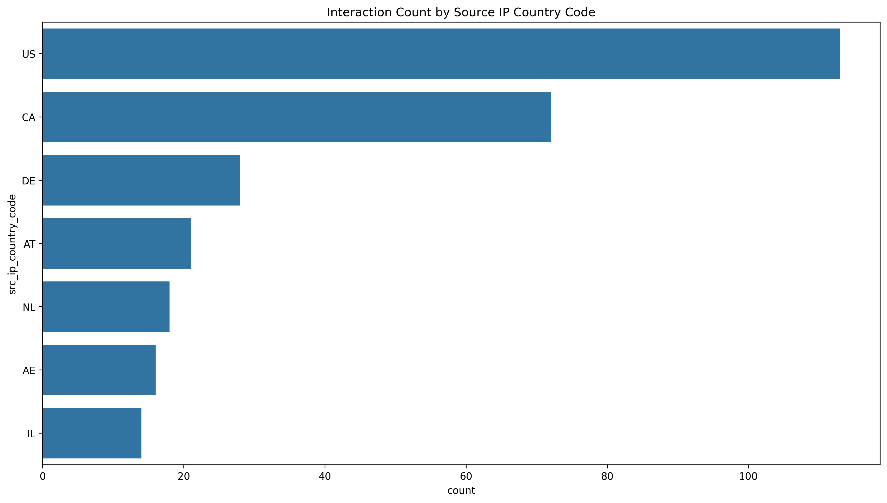
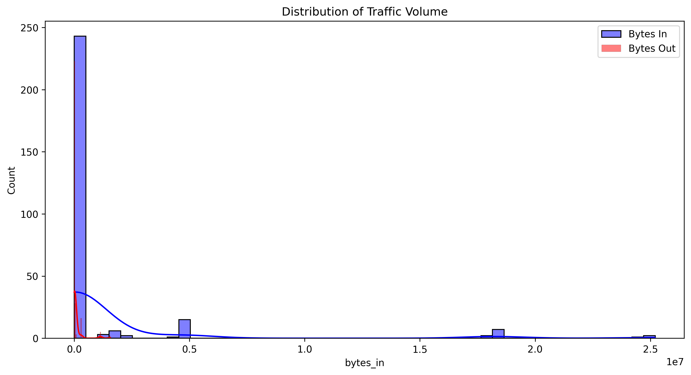
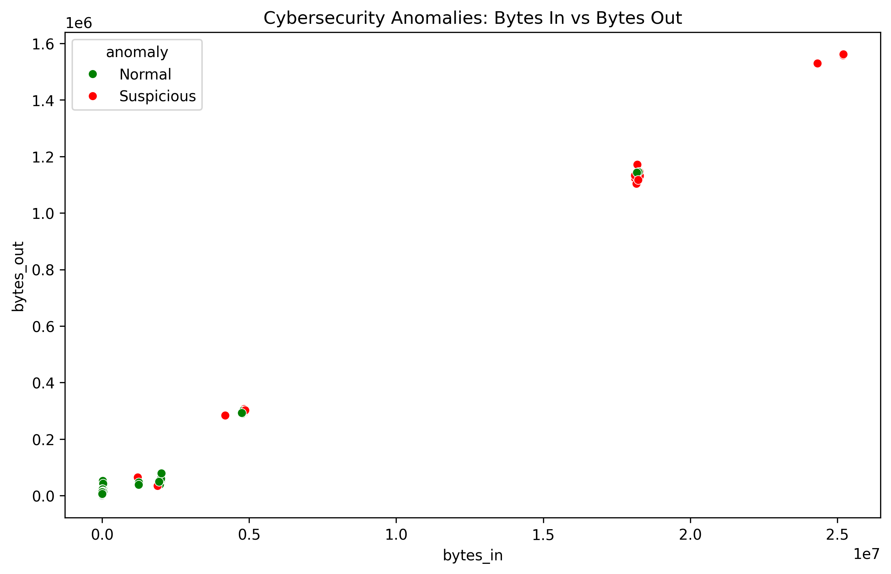
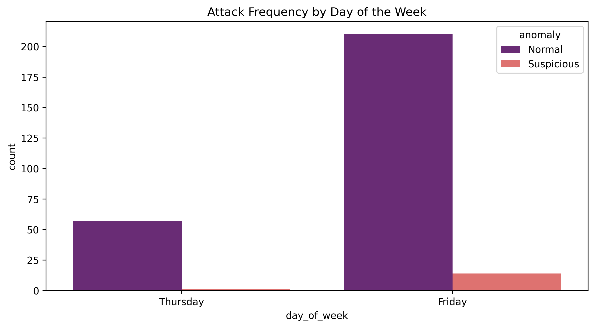

# Cybersecurity: Suspicious Web Threat Interactions

## 📌 Project Overview
This project focuses on analyzing AWS CloudWatch traffic logs to identify suspicious web interactions and potential cyber threats. Using **Python** and **Machine Learning**, I implemented an anomaly detection system to distinguish between normal traffic and malicious activity.

This is an **Advanced Level** project part of my Data Analytics internship.

## 🛠️ Tech Stack
- **Language:** Python 3.x
- **Environment:** VS Code, Jupyter Notebook
- **Libraries:** Pandas, Matplotlib, Seaborn, Scikit-Learn (Isolation Forest)

## 📊 Exploratory Data Analysis
During the initial analysis, I examined the geographic distribution of traffic and the volume of data being transferred.

### 1. Traffic by Country
This chart shows which countries are the primary sources of traffic in our logs.

### 2. Traffic Volume Distribution
Analysis of `bytes_in` and `bytes_out` to identify patterns in data transfer.

## 🤖 Machine Learning: Anomaly Detection
I utilized the **Isolation Forest** algorithm to detect anomalies. This model is highly effective for cybersecurity because it identifies data points that are "few and different" (outliers).

### Anomaly Results
- **Normal Traffic:** Green
- **Suspicious Traffic:** Red

## ⏰ Temporal Patterns
I analyzed traffic based on the day of the week to see if suspicious activity spikes during specific times.

## 🔍 Key Findings
1. **Anomaly Detection:** The AI model successfully flagged high-volume traffic patterns that deviate from standard web server interactions.
2. **Top Threats:** Specific countries showed a higher density of "Suspicious" labels, indicating targeted scanning or botnet activity.
3. **Behavioral Insights:** Suspicious interactions often involve significantly higher `bytes_in` compared to `bytes_out`, typical of injection attempts or brute-force attacks.

## 🚀 How to Run
1. Clone this repository.
2. Install dependencies: `pip install pandas matplotlib seaborn scikit-learn`
3. Run the `analysis.ipynb` notebook in VS Code.

---
*Developed for the Unified Mentor Internship Program.*
